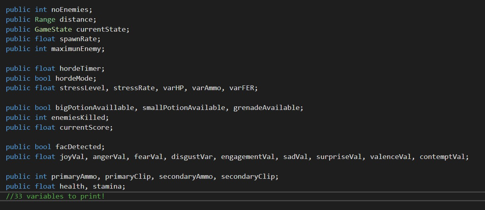
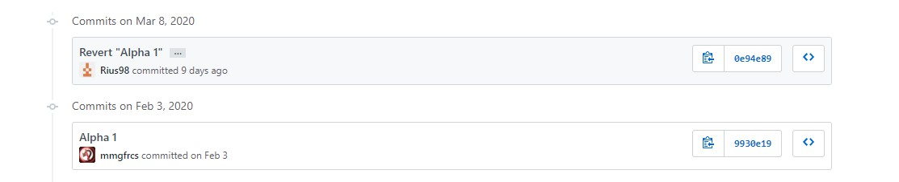

# End of Research Troubles
*Virya Dharmawan* | *19/03/2020*

So, the first log after Research officially ended. Since this document is supposed to be read by team members, I'll cut to the chase and actually document what happened

## Before: Progress
The progress for the first week has been pretty nonexistent. The project still stands as it is before meeting our supervisor on March 6. After that meeting, I went off to work on saving all the game's data into a file. The task of that week were:
1. Document the data by saving them to a file
2. Change the probability of the easy state and the hard state (named, in code, Build Up 3 and 1 respectively) so there is less chance that the same state is picked by the game
3. Implement some kind of a Smart AI... at least the design of it

To be honest, I forgot doing Task 3 since that was self-assigned. However, I did finish Task 1 and 2, leaving Task 3 for the next week. Here are all the variables saved by the game:

That's quite a lot. I finished that in a day and left it for testing after I finished Task 2, which took another day since the system involved in doing this is pretty simple but tangled, and any loose ends will make the game go into a floating state where the probabilities went haywire. Furthermore, the first one is already a lot of work since I prepared several formats for it to output - so later each format can be tested for its compactness and human readability - and with a lot of other things on the way, I just need to slow down.

And slow down I am. For a week.

## After: Disaster
I will agree to you, it *is* a lot of time wasted for what's basically a 4 month project. However, it is actually a saving grace for what's about to happen. If I hadn't slow down, I would've lost a lot more.

The issue comes in the form of GitHub. You see, I opened GitHub Desktop for the first time in a month since the last commit. There was a new commit made, so reflexively I pulled them.

*It does not error out*

Usually when that happens, it was fine, right? Yeah, I think so. However, something is fishy. When I opened Unity, it spews out errors in the hundreds, most of which is filled with undeclared variable names. I never have these errors went past my head before, and to receive it in the *hundreds* tell me something's up. This is when I opened GitHub through the browser and see that the new commit was a *revert* (to be honest, I can actually just open GitHub desktop to see it but whatever).

Specifically, a revert of the Alpha 1 commit

This revert alone causes the whole project to go back in time by ***5 months!*** Well, in hindsight I should've committed more, but posting the project to the repo was sort of an afterthought during Research, so... yeah.

I posted this news to the team. Meanwhile, I looked at a way to restore the situation. There are 2 proposed solutions: Revert it back with `git revert`, which clutters the commit history, or reset the history with `git reset`. I go with `git reset` since it erases the commit as well and not taking up unnecessary memory (git stores *everything* you committed, even reverted ones). Reading the command, I realized that all my changes after that commit will be gone.

I went ahead and started the process. It was real quick, and there goes all the changes. Casualties? Around 500 lines of code and some scene work. Not much but still a loss.

## What's Next
Well, the next thing to do is to restart doing all of the above. After that, maybe 3. That is only if I'm not distracted by other things to do.