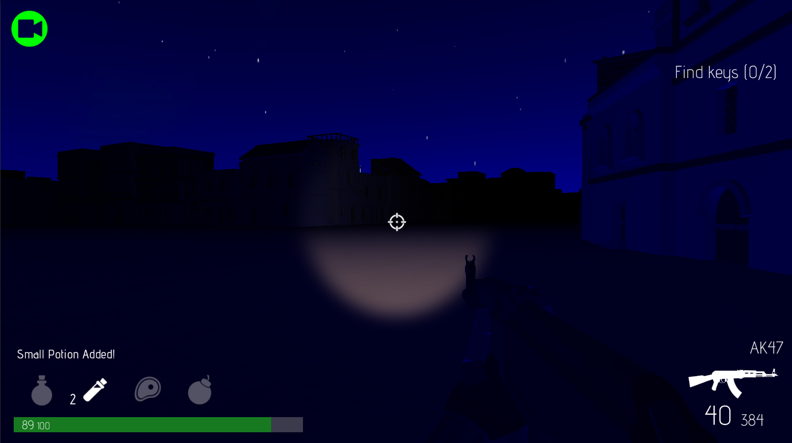
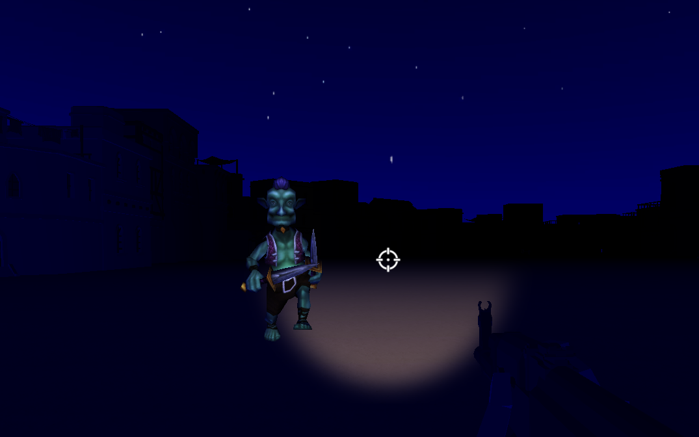
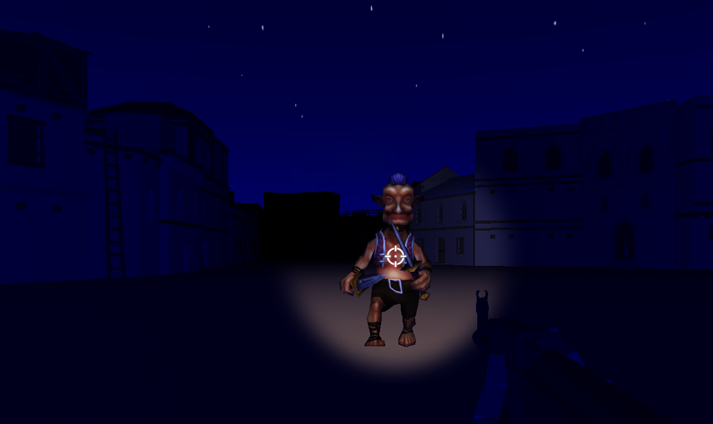
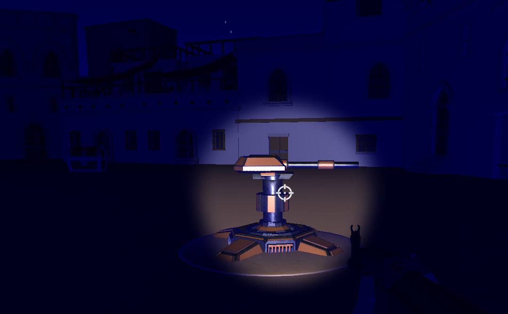
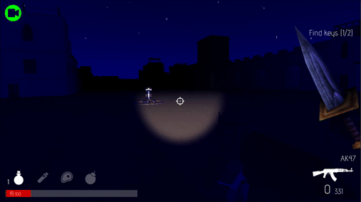

# Surefire Survive v2
*Virya Dharmawan* | *19/04/2020*

It's been a while since the last log, but oh boy is there a lot of changes since last time. These changes are quite drastic, so I would name these changes *Surefire Survive v2* just because it kinda overhauls the gameplay a bit.

So, what are the changes, you ask?

## UI Changes
The game now boasts a new look:

The first thing that is obvious from the image is that the icons for potions and grenades have been moved so that it is above the health bar. This is done to vacate the middle area of the screen, which can now be used for some interesting mechanics, such as multiplayer.

Then, the fonts are now consistently used for all UI elements, and most of them is now around 10-20% larger than it was to improve a bit on legibility. This applies to the debug screen too.

Finally, the Game Over manager has some layout changes to cater some other stuff added to it on the next update. The Back button also received a change: it will be hidden for a few seconds so players wouldn't press that button too quickly.

## Control Changes
In the controls department, opening chests (and interacting in general) now use the E key instead of F to make it consistent with other games. Items are now bound to the 1-3 key instead of the jarring 3 and 4, with Grenade unchanged at G. Switching weapons can now be done using the Mouse Wheel for those of you FPS gamers. All other keys remain unchanged, except for the Shift key which is now unused since running won't be a thing anymore, which will be explained below.

## Enemy Changes
In the previous experiment, the game was hard because the enemy is just too much to handle at once. With these changes, the game retains its difficulty (still hard) but the reasons are now different: The enemy has more variety and quirks than last time.

Introducing the 2 new types of the basic enemy, the Goblins:
Blue Goblin | Red Goblin
:------:|:------:
 | 

The blue Goblin moves and hits faster than an ordinary Goblin, but each hit deals 50% less damage. Don't let that fool you though, because when left alone, they can dish out higher amount of damage than the ordinary Goblin. Fortunately, they have less HP, requiring fewer shots to kill.

The red Goblin, on the other hand, attacks faster, has more HP and deal bigger damage than an ordinary Goblin. It's quite an upgrade, but it moves at the same speed as the player, so players could run away from it without it ever catching up.

Other than new types of Goblins, there's one more enemy that players have to watch out for:

Yes, Turrets!

They have a high attack speed, have even higher HP than the red Goblin and attack from a range. While their damage is not much - lower than the blue Goblin - they can deal tons of damage over time if not stopped. Fortunately, they do not spawn dynamically; they always spawn at the same point every time so players can prepare for their barrage of shots on their subsequent playthroughs.

So what did you get for these new enemies?

Mayhem.

(The mouse is at max sensitivity. Forgive the inaccuracy)

## Statistics Changes
Now for the numbers. These changes are invisible, but balancing becomes just a bit easier.

For once, the HP of all enemies are dropped by 90% and the damage of the player is reduced by 92%. This means that the HP now fits in the thousands range for the boss, and about the same HP as the player for the Goblins and Turrets.

As you can see by the percentage, the players' damage has been slightly nerfed. The number of shots to kill does not change for normal Goblins, but the damage of those shots have been reduced by 20%. While this only mean minor differences for enemies with low HP, the damage reduction will have a greater impact on enemies with higher HP. For example, the Boss now takes 100 shots to kill with the assault rifle, up from the previous 84 shots.

## Item Changes
Items also undergo significant changes. For a start, the Big Potion will now heal over time instead of instantaneously, healing double the HP in the same amount of time as the small potion. The small potion's healing value has been lowered by 20% so the big potion - while maintaining the ratio of double the healing strength of the small potion - has the same value in HP as before.

There's also a new item on the bar. If you paid attention, you might notice a new icon:

Now that's a Medikit, which replaces the role of the big potion: providing instant healing. This kit is potent, healing 100% HP instantly. Only problem is that it's quite rare, so you'll better rely on the potions for healing.

The Grenade also undergoes a few changes: Its damage has been severely dropped. It kills the blue and normal Goblin, but it won't kill the red goblin, the turret and the boss. Don't really hope to put a dent to the boss' HP with the grenade, it's not going to go well. The grenade also has some pushback for the player as well (not the enemy... yet)

## And A Lot More Coming
There's a lot of changes, too many to mention in this document. More on minor changes can be seen in the commit message. Furthermore, there's a few more unimplemented changes, such as Care Packages
and Game State Changes, which will come soon.