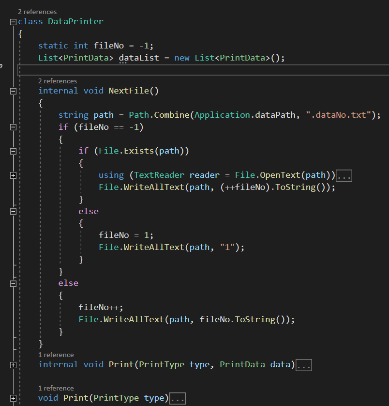
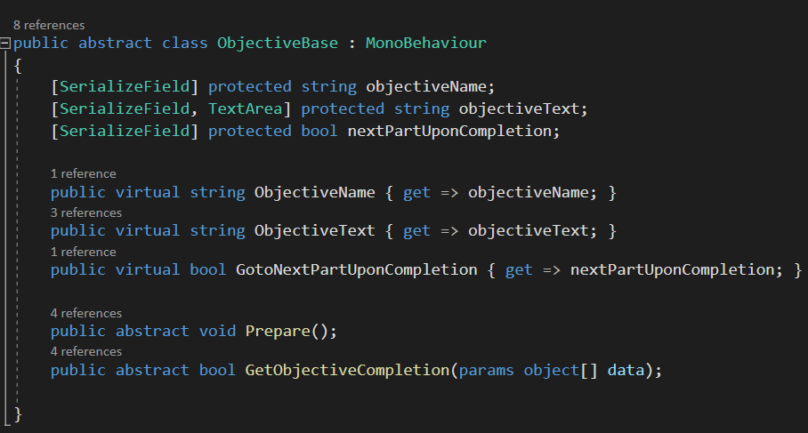
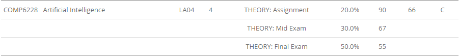

# Changes! A lot of it!
*Virya Dharmawan* | *29/03/2020*

To this day, nothing exciting really happened. It's not that *nothing* happened, it's just nothing *exciting* happened.

But enough of that. From the last log to today, a few things changed:
1. Data Printer has been finished
2. A few decisions that will shape future work
3. How the game handles objectives

## `DataPrinter` class

This class manages game data printing to file, where each file represents a game. This class also manages the name for those files.

The game now prints its data through this class. Printed data can be in either CSV or JSON. Data printed to the file includes, but not limited to:
1. Enemy Amount
2. Enemy Distance (Average, Min, Max)
3. Game States
4. Stress Level
5. Emotions Value
6. Items Status
7. Ammunition Status

As of writing, there are 35 variables recorded, and game data is recorded each second the game is playing.

## Objectives
Objectives are now handled differently by the game. All objectives were once hardcoded into the game, and changing them involves changing a quarter of the Game Manager. Since a new map is to be built and new objectives may be assigned, an overhaul is necessary.

So, the overhaul:
1. All objectives are now a class which derived from `ObjectiveBase`. This parent class is an abstract class which exposes the `Prepare()` and `GetObjectiveCompletion()` function which is called by the Game Manager.

2. The Game Manager keep a list of objectives assigned to it on the inspector, and it will go through this list one by one until it has used all the objectives assigned to it, in which case the game ends in a win.
3. For each objective, `Prepare()` is called when it is chosen so the objective can prepare its internal variables.
4. Any script can call `CompleteObjective()` on the Game Manager to indicate an objective's completion. The Game Manager will then pass the call to the current objective's `GetObjectiveCompletion()` method, which tells the Game Manager whether the objective is considered finished or not.
5. Since all objective scripts are based on `ObjectiveBase`, which is based on `MonoBehavior`, the script can use all kinds of methods to check that the objective has been completed. Furthermore, the Game Manager doesn't even need to *know* what to do to complete the objective, it just needs to know whether it was completed.
6. If the objective reports that it was completed, the Game Manager simply chooses the next objective.

This way, no actual information is passed to the Game Manager about the objective...

...*Except* what the objective class is a type of.

C# has the *is* operator, which allows you to check the type of a variable:

```csharp
//variable is Type
if(currentObjective is FinalObjective) {
    //Code
}
```

This allows the GameManager to do things based on the script's type. A script with such code is a *special objective*. One example of this is the Final Objective, which changes the game considerably.

## Project Discussions
As this document was typed, a discussion was in progress about the game's design. A few changes were proposed, and all of them was reviewed. Changes include:
1. Player can no longer run
2. Care packages are available
3. Damage numbers are reduced
4. Stats change
5. New Enemies and Chest contents

The result of this discussion will reflect on the next log

### Task 2 Cancelled
With this discussion, one thing also came out. Remember Task 2 on the last log?
```markdown
2. Change the probability of the easy state and the hard state (named, in code, Build Up 3 and 1 respectively) so there is less chance that the same state is picked by the game
```

...it was cancelled. Which means reverting a few code changes. -_-

## What about the Smart AI?
I tried. I really did. After all, the one who taught me about AI is our supervisor.

But then again...


Yeah. Not going to happen soon enough.